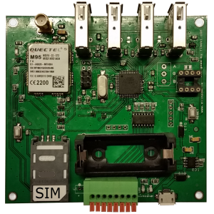

#### Tinovi Arduio quactel M95 GSM GPRS development board

This is a Tinovi Arduio quactel M95 GSM GPRS development board third-party hardware usaga sample code for IDE like eclipse based on Arduino libraries.
Use this or similar tutorial to add this project to Eclipse CDT IDE [Arduino Eclipse](http://playground.arduino.cc/Code/Eclipse)

To programm board you should add AVR ISP compatable programmer to eclipse avrdude config properties.

This source includes Arduino library and modified arduino GSM GPRS library cloned from [github](https://github.com/arduino/Arduino/tree/master/libraries/GSM). This libray works on harware serial instead of original software serial version. Harware serial is clone [from](https://github.com/SlashDevin/NeoHWSerial) .

Inpelementation of TLS/SSL part is not yet finished.

Please consult [Forums](https://tinovi.com/forum/) for more information!

[Schematic](schematic.pdf)

Tinovi GSM board is has total 8 analog/digital inputs accessible vai 4 connectors 2 inputs each and 4 NPN transistor outputs. It is based on ATMEGA644PA-AU MCU and quactel M95 Quad-band GSM/GPRS module.
This board has onboard CR123A/16340 Li-ion rechargeable battery socket with 5V micro-USB charger socket. Modem firmware is designed for low power sleep modes with pulse input counters for meter applications to live on battery power for long time. You also may connect solar power packs to 5v micro-USB charger circuit input.
Inputs has USB-A type connector male socket each having access to 2 ATMEGA644PA-AU analog IO pins (PA0-PA7). USB A-Type connector is very flexible. It allows to directly plug in PCB board with sensor adapter on it. Also can be used for custom outputs.
Currently we have adapted DTH11 or DTH22 humidity and temperature sensors as well as popular DS18B20 digital temperature and NTC10K analog temperature sensors. For industrial applications there are adapters for 0-10 voltage and 0-20mA current inputs. For ATMEGA644PA-AU UART0 (Arduino Serial) there is option to solder in the board RS485 line driver and terminal connector to access industrial devices.

### Board features:

- 8 analog/digital inputs/outputs (Arduino pins  A0, A1, A2, A3, A4, A5,A6, A7)
- 4 open collector opticoupler outputs (Arduino pins 2,3,4,5)
- Digital inputs are 5v tolerant with built in level shifters for esp8266 digital IO
- Each USP-A type connector has 5v power and ground
- firmware to connect to Tinovi cloud services
- Size 98*95mm

[Tinovi Shop](https://tinovi.com/product-category/telemetry/telemetry-devices/)

